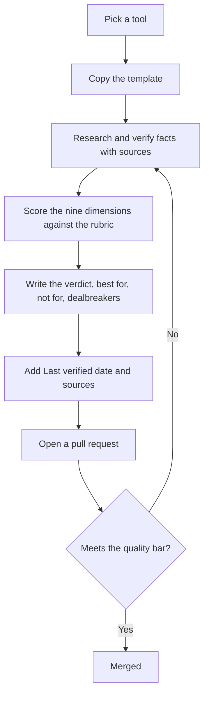

# Contributing to WhichAI

Thank you for helping. The value of this project is trust, so the standards below matter as much as the content. Read them before you start.

## Three ways to help

1. **Suggest a tool** you want reviewed. [Open an issue](.github/ISSUE_TEMPLATE/suggest-a-tool.md).
2. **Correct or update** a fact in an existing review. [Open an issue](.github/ISSUE_TEMPLATE/correct-or-update.md) or send a pull request.
3. **Write a full review.** Use the [tool entry template](docs/tool-entry-template.md) and the [rating methodology](docs/rating-methodology.md).

## The non-negotiables

These come from the [editorial rules](docs/requirements.md#5-our-promise-the-editorial-rules). A contribution that breaks them will not be merged.

- **No paid placement.** No money or favor changes a score, a rank, or whether a tool appears.
- **Disclose conflicts.** If you work for, invest in, or are paid by a tool, say so at the top of the review in the `disclosure` field.
- **No affiliate influence.** Affiliate links are not allowed in reviews.
- **Cite and date.** Volatile facts (pricing, model names, limits) need at least two independent sources and a Last verified date.
- **State the dealbreakers.** Every review names who should not use the tool.
- **Be honest, not balanced for its own sake.** When the evidence is one sided, say so.

## How to write a review

Steps:

1. Copy the skeleton from [docs/tool-entry-template.md](docs/tool-entry-template.md) into `tools/<category>/<slug>.md`.
2. Fill the front matter. The `slug` must match the filename.
3. Verify the volatile facts on the vendor's own pages, and on at least one independent source. Note the date you saw each.
4. Score the nine dimensions using the [rubrics](docs/rating-methodology.md). Use `N/A` when you cannot assess one.
5. Write the body. Concrete points, not adjectives. Name at least one dealbreaker.
6. Pick a recommendation tier and say who it applies to.
7. Add the tool to its category `README.md` shortlist.
8. Open a pull request.

## Style guide

- **Plain language.** Write the way you would explain it to a friend. No marketing words.
- **Facts get sources. Opinions get marked as judgment.** Keep the two visibly separate.
- **Specific beats vague.** "Free tier is 2,000 completions a month" is better than "generous free tier."
- **Date the volatile stuff.** Prices and model names change. Always say when you checked.
- **Respect the reader's time.** Lead with the verdict and the best for / not for.

## Review process

A maintainer checks each pull request against the [quality bar](docs/requirements.md#10-quality-bar-and-governance): template followed, required fields present, sources dated, dealbreakers named, conflicts disclosed. Factual corrections are merged quickly. Verdict changes may get a second opinion, and genuine disagreement is recorded in the review rather than hidden.

## Code of conduct

By taking part you agree to the [Code of Conduct](CODE_OF_CONDUCT.md). Be respectful, assume good faith, and keep it about the tools.
