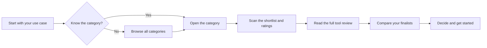

# WhichAI

**Find the right AI tool for your use case. Honest reviews, side by side comparisons, and clear ratings across every domain.**

WhichAI is a community guide to AI tools. The goal is simple: when you have a task in mind, you should be able to come here and get the kind of recommendation a knowledgeable friend would give you. Not the loudest tool. Not the best marketed one. The one that actually fits what you need.

We cover every domain and every type of tool: open source, free, subscription, and enterprise. No category is off limits, as long as the tool is genuinely an AI tool.

> Honesty first. We do not take payment for placement or ratings. If a free or open source tool is the better pick, we say so. See [our promise](docs/requirements.md#5-our-promise-the-editorial-rules).

---

## How to use this repository



| If you want to... | Go to |
| --- | --- |
| Understand what this project is and how it works | [Requirements and specification](docs/requirements.md) |
| Browse tools by domain | [Categories](docs/categories.md) |
| See how we score and rate tools | [Rating methodology](docs/rating-methodology.md) |
| Read a tool review | [All tools](tools/README.md) |
| Compare tools head to head | [Comparisons](comparisons/README.md) |
| Add or correct a tool | [Contributing](CONTRIBUTING.md) |

---

## Browse by domain

The starter set below has full reviews today. The rest of the map is planned and open for contributions. See the full taxonomy in [Categories](docs/categories.md).

**Available now:**

- [Coding assistants](tools/coding-assistants/README.md): GitHub Copilot, Cursor, Aider
- [General AI assistants](tools/ai-assistants/README.md): ChatGPT, Claude, Gemini
- [Image generation](tools/image-generation/README.md): Midjourney, DALL-E, Stable Diffusion

<details>
<summary><strong>See the full domain map (planned coverage)</strong></summary>

- Build and code
- Write and edit
- Converse and assist
- Images and design
- Audio and music
- Video
- Knowledge and research
- Data and analytics
- Business and productivity
- Developer platforms (model APIs, agents, vector stores, evals)
- Marketing and media
- Education and learning
- Regulated verticals (health, legal, finance)
- Agents and automation
- Security

Full breakdown with subcategories: [Categories](docs/categories.md).

</details>

---

## How ratings work

Every tool is scored on nine dimensions, each on a 1 to 5 scale with a written rubric, so the scores mean the same thing across reviews.

| Dimension | What it measures |
| --- | --- |
| Capability | How well it does the core job |
| Ease of use | How quickly you get value, learning curve |
| Reliability | Stability, uptime, how often it breaks |
| Value | What you get for the price |
| Ecosystem | Integrations, plugins, platform support |
| Docs and support | Quality of docs, help, community |
| Privacy | Data handling, training on your data, controls |
| Momentum | Active development, adoption, longevity |
| Portability | Export, open standards, lock-in risk |

Scores are inputs, not the verdict. The bottom line is a written judgment about who the tool fits and who it does not. Details in [Rating methodology](docs/rating-methodology.md).

---

## Contributing

Anyone can suggest a tool, correct a detail, or write a full review. Start with [CONTRIBUTING.md](CONTRIBUTING.md). The short version:

1. Use the [tool entry template](docs/tool-entry-template.md).
2. Cite your sources and date them.
3. Be honest and balanced. State the dealbreakers.
4. Disclose any affiliation with the tool.

<details>
<summary><strong>Repository map</strong></summary>

```text
WhichAI/
  README.md                      You are here
  CONTRIBUTING.md                How to add or correct tools
  CODE_OF_CONDUCT.md             Community standards
  docs/
    README.md                    Docs index
    requirements.md              What this project is, in full
    categories.md                The domain taxonomy
    rating-methodology.md        How scoring and verdicts work
    tool-entry-template.md       Copy this to add a tool
  tools/
    README.md                    Index of every reviewed tool
    coding-assistants/
    ai-assistants/
    image-generation/
  comparisons/
    README.md                    Head to head comparisons
  .github/                       Issue and pull request templates
```

</details>

---

## A note on freshness

AI tools change fast. Prices move, models get renamed, features ship and break. Every review carries a **Last verified** date and links to its sources. If you find something out of date, please [open an issue](.github/ISSUE_TEMPLATE/correct-or-update.md) or send a fix. A dated, sourced review you can trust is worth more than a polished one you cannot.

## Disclaimer

Reviews reflect the honest judgment of contributors at the time of writing. They are not a substitute for your own testing, especially for regulated work in health, legal, or finance. Always confirm pricing and terms on the vendor's own site before you commit.
