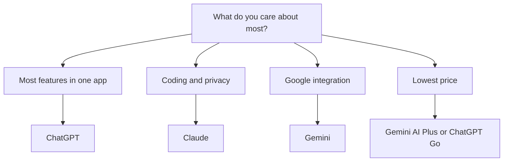

# ChatGPT vs Claude vs Gemini

The three big general assistants are close on raw capability and all change fast. The honest way to choose is by what you care about most. Full reviews: [ChatGPT](../tools/ai-assistants/chatgpt.md), [Claude](../tools/ai-assistants/claude.md), [Gemini](../tools/ai-assistants/gemini.md).

**Last verified:** 2026-06-05

## Short answer

- Want the **broadest, most capable all-rounder** with voice and image generation in one app? **ChatGPT.**
- Want the **best coding and long-document work**, plus a no-training-by-default posture? **Claude.**
- Live in **Google products** and want AI inside Search, Gmail, and Docs? **Gemini.**

## Decide by what matters to you

## At a glance

| | ChatGPT | Claude | Gemini |
| --- | --- | --- | --- |
| Vendor | OpenAI | Anthropic | Google |
| Entry price | Free, Go $8/mo, Plus $20/mo | Free, Pro $17/mo | Free, AI Plus ~$7.99/mo |
| Trains on chats by default | Yes, opt out | No, opt in only | Yes, human review of a subset |
| Ads on cheaper tiers | Yes (Free and Go, US) | No | No |
| Image generation | Strong | Weak or absent | Strong |
| Voice | Strong | Weaker | Strong |
| Coding | Strong | Strongest | Strong |
| Long context | Large | Very large (1M) | Large (1M) |
| Best at | Breadth of features | Coding, long docs, privacy | Google ecosystem |

## The biggest real difference: privacy

Capability is close. Privacy defaults are not, and this is where the honest gap shows.

- **Claude** does not train on your chats unless you turn it on. The catch: accepting that prompt raises retention from 30 days to 5 years.
- **ChatGPT** trains on personal-tier chats by default. You can opt out in settings.
- **Gemini** has a subset of chats reviewed by humans by default, with retention up to 3 years, and turning the setting off also removes your chat history.

If privacy is your priority, Claude has the best default. If you pick ChatGPT or Gemini, change the data settings first.

## On price

Gemini's AI Plus (about $7.99/mo) and ChatGPT Go ($8/mo) are the cheapest paid entries, and Gemini bundles storage and YouTube perks on higher tiers. ChatGPT Go is ad-supported in the US. Claude has no sub-$17 paid tier but no ads anywhere.

## Bottom line

There is no single winner, which is why two of the three are top picks for different people. Choose **ChatGPT** for the most features and the largest ecosystem. Choose **Claude** for coding, long documents, and the strongest privacy default. Choose **Gemini** if you live in Google products or want the cheapest entry with bundled perks. Whichever you pick, set the privacy options before you start.

Back to [comparisons](README.md) | [General AI assistants](../tools/ai-assistants/README.md)
