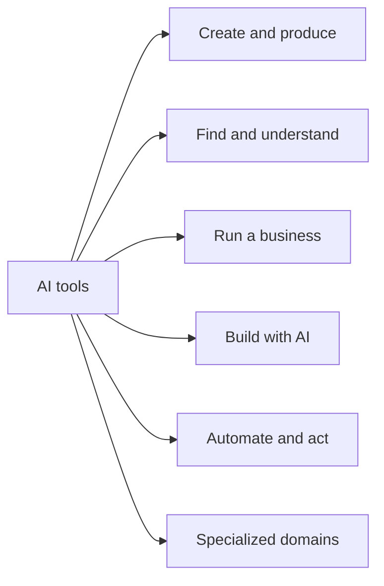

# Categories

The domain map for WhichAI. The aim is full coverage of AI tools and apps with no boundary on domain. The map is organized into six groups so it stays easy to scan. Prefer to browse by job instead? See [Professions](../professions/README.md).

**Status legend:** a checked item has at least one full review today. An unchecked item is planned and open for contributions.

---

## A. Create and produce

Tools that make something: code, words, images, audio, video.

<strong>Subcategories</strong>

- [x] **Coding assistants** ([reviews](../tools/coding-assistants/README.md)): write, complete, and refactor code. Example task: "autocomplete and explain code in my editor."
- [x] **Image generation** ([reviews](../tools/image-generation/README.md)): make images from text. Example task: "create product art from a prompt."
- [ ] Writing and editing: drafting, rewriting, grammar. Example task: "tighten this article."
- [ ] Image editing and enhancement: upscaling, background removal, retouching.
- [ ] Design and UI: generate layouts, mockups, design systems.
- [ ] Speech to text: transcription and captions.
- [ ] Text to speech and voice: narration, voice cloning.
- [ ] Music generation: tracks, stems, sound design.
- [ ] Video generation: text or image to video.
- [ ] Video editing and dubbing: cuts, subtitles, translation.

## B. Find and understand

Tools that help you get answers and make sense of information.

<strong>Subcategories</strong>

- [x] **General AI assistants** ([reviews](../tools/ai-assistants/README.md)): broad chat assistants for many tasks. Example task: "draft, summarize, and answer questions."
- [ ] Search and answer engines: cited answers from the live web.
- [ ] Research assistants: gather and synthesize sources.
- [ ] Document and data Q&A: chat with your files and PDFs.
- [ ] Note-taking and knowledge management: AI on top of your notes.
- [ ] Data analysis and business intelligence: ask questions of your data.
- [ ] Data extraction and scraping: pull structured data from messy sources.

## C. Run a business

Tools for the day to day work of teams and companies.

<strong>Subcategories</strong>

- [ ] Meeting assistants and notetakers: record, transcribe, summarize.
- [ ] Email, calendar, and scheduling: draft replies, book time.
- [ ] Slides and presentations: generate decks.
- [ ] Customer support and chatbots: deflect and assist tickets.
- [ ] Sales and marketing automation: outreach, CRM enrichment.
- [ ] SEO and content marketing: research, briefs, optimization.
- [ ] Project and task management: AI inside your planning tools.

## D. Build with AI

Tools for developers building their own AI features and products.

<strong>Subcategories</strong>

- [ ] Foundation model APIs: the underlying language, image, and audio models.
- [ ] Agent and orchestration frameworks: chain calls, tools, and memory.
- [ ] Vector databases and retrieval: store and search embeddings.
- [ ] Fine-tuning and training platforms: adapt models to your data.
- [ ] Evaluation and observability: measure quality, trace, and monitor.
- [ ] Inference and model hosting: serve models at scale.
- [ ] Guardrails and safety tooling: filter, validate, and constrain output.

## E. Automate and act

Tools that take actions, not just produce output.

<strong>Subcategories</strong>

- [ ] General autonomous agents: take a goal and carry out multi-step work.
- [ ] Workflow automation with AI: connect apps with AI steps.
- [ ] Browser and computer-use agents: operate software like a person.
- [ ] Robotic process automation with AI: automate repetitive system tasks.

## F. Specialized domains

Tools for fields with their own rules and risks. Reviews here carry extra caution notes, since mistakes can be costly.

<strong>Subcategories</strong>

- [ ] Education and tutoring: learning, teaching, grading aids.
- [ ] Healthcare: clinical notes, intake, research support. Treat with caution and verify compliance.
- [ ] Legal: research and drafting aids. Treat with caution and verify accuracy.
- [ ] Finance and accounting: analysis and reconciliation aids. Treat with caution.
- [ ] Security, AI for defense: threat detection, triage, response.
- [ ] Security, protecting AI systems: testing for prompt injection and model risks.

---

## Missing a category?

The map will never be complete on its own. If your use case does not fit, that is useful signal. [Suggest a category or tool](../.github/ISSUE_TEMPLATE/suggest-a-tool.md) and we will add it.

Back to [README](../README.md) | [Requirements](requirements.md) | [Rating methodology](rating-methodology.md)
