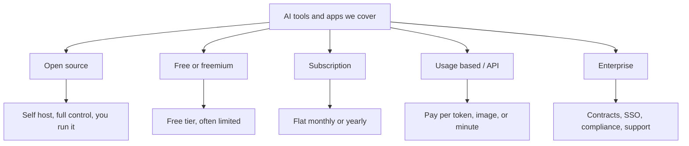
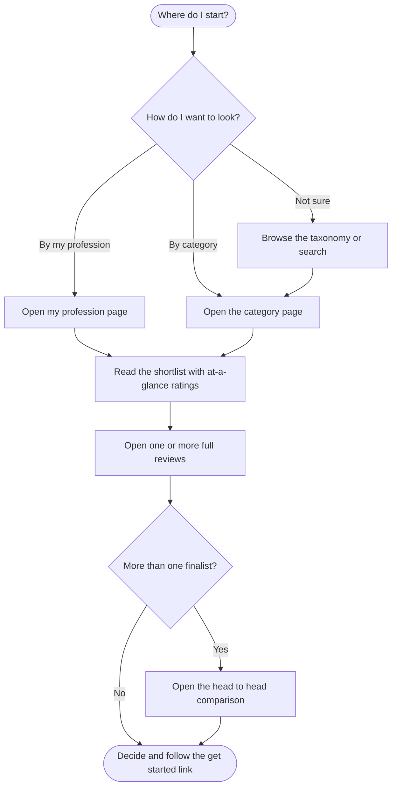
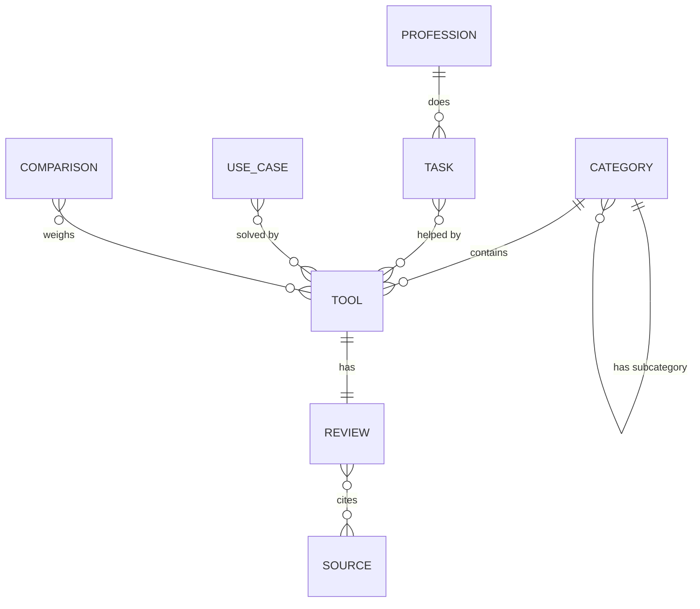
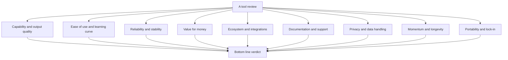

# WhichAI: Requirements and Specification

**Status:** Draft v1
**Last updated:** 2026-06-05

This document explains what WhichAI is, who it serves, how it is structured, and the standards that keep it trustworthy. If you are here to contribute, read this first, then [CONTRIBUTING.md](../CONTRIBUTING.md).

## Contents

1. [Purpose and problem](#1-purpose-and-problem)
2. [Goals and non-goals](#2-goals-and-non-goals)
3. [Who this is for](#3-who-this-is-for)
4. [Scope](#4-scope)
5. [Our promise: the editorial rules](#5-our-promise-the-editorial-rules)
6. [How people use it](#6-how-people-use-it)
7. [Content model](#7-content-model)
8. [Evaluation framework](#8-evaluation-framework)
9. [Repository structure](#9-repository-structure)
10. [Quality bar and governance](#10-quality-bar-and-governance)
11. [Contribution overview](#11-contribution-overview)
12. [Roadmap](#12-roadmap)
13. [Open questions](#13-open-questions)

---

## 1. Purpose and problem

There are thousands of AI tools and a new wave arrives every week. For most people the problem is not finding a tool. It is finding the *right* one for their actual task, and trusting that the recommendation is honest.

Today that information is scattered and biased. Vendor sites oversell. Affiliate blogs rank tools by commission. Social media chases hype. Reviews go stale within months and no one updates them.

WhichAI exists to fix this. It is one place where someone can describe what they want to do and get a clear, honest, current recommendation, with the reasoning shown and the sources linked. The test we hold every entry to:

> Would a knowledgeable friend, with nothing to gain, recommend this to you for your use case?

## 2. Goals and non-goals

**Goals**

- Help a person move from a use case to a confident decision quickly.
- Cover every domain and every business model: open source, free, subscription, enterprise.
- Rate tools on consistent, written criteria so scores are comparable.
- Keep entries current, dated, and sourced.
- Make the honest tradeoffs obvious, including when *not* to use a tool.
- Stay readable and easy to navigate.

**Non-goals**

- Not a directory that lists everything with no opinion. Opinion, backed by evidence, is the point.
- Not a news feed. We track tools, not daily announcements.
- Not a benchmark lab. We cite credible benchmarks, we do not claim to run our own definitive ones.
- Not pay to play. No vendor can buy a rating, a ranking, or a place.
- Not a replacement for your own trial, especially for regulated or high stakes work.

## 3. Who this is for

<details open>
<summary><strong>The four people we write for</strong></summary>

| Persona | What they need | How we serve them |
| --- | --- | --- |
| **The builder** (developer, engineer) | The best tool for a technical job, with detail on integrations and lock-in | Deep reviews, comparisons, API and license notes |
| **The professional** (writer, marketer, designer, analyst) | A tool for a specific work task, explained without jargon | Plain language "best for" guidance and quick shortlists |
| **The decision maker** (team lead, founder, buyer) | Cost, security, privacy, vendor stability, lock-in for the team | Pricing, privacy, momentum, and portability scores plus a clear verdict |
| **The explorer** (curious, hobbyist, student) | To learn what exists and what is worth their time | Browsable categories and honest "is this worth it" verdicts |

</details>

Every review should be useful to at least the first three. We avoid jargon, and when we must use a term we link it or explain it.

## 4. Scope

**What counts here.** Any product whose core value comes from machine learning or generative models. We use the word "tool" broadly: it covers developer tools and everyday apps alike, from a command line utility to a phone app to a web service. What matters is that AI is central to what it does. A normal app with a token "AI" feature bolted on does not qualify on its own.

**Types we cover.** All of them, marked clearly so the cost picture is honest:



**Domains we cover.** Every domain, with no boundary. The full taxonomy lives in [Categories](categories.md). The starter set ships with coding assistants, general AI assistants, and image generation, and the structure is built to grow into the rest.

**Professions we cover.** Every profession we can write a useful guide for. Many people do not think in domains, they think in jobs: "I am a teacher, what should I use?" The [Professions](../professions/README.md) section answers that, mapping each role's real tasks to the tools and apps that help. Dedicated pages start with twelve common professions and grow from there.

## 5. Our promise: the editorial rules

These rules are what make the recommendation trustworthy. They are not optional. A review that breaks them does not get merged.

1. **No paid placement.** No money, gift, or favor changes a score, a rank, or whether a tool appears. Ever.
2. **Disclose conflicts.** If a contributor works for, invests in, or is paid by a tool, the review must say so at the top.
3. **No affiliate links in reviews.** If a link earns the project anything, it is labeled plainly and never influences the verdict.
4. **Best fit wins.** If the free or open source option is the better pick for a use case, we say so, even when a paid tool is more popular.
5. **State the dealbreakers.** Every review names who should *not* use the tool and why.
6. **Separate fact from opinion.** Facts get sources. Opinions are marked as judgment.
7. **Date and source everything.** Every review has a Last verified date and links to where the facts came from.
8. **Flag the stale.** An entry past its freshness window is marked as needing review rather than presented as current.
9. **Balance, not both sides for its own sake.** When the evidence is one sided, we say so. We do not manufacture fake balance.

## 6. How people use it

The core journey, from who you are or what you want to a decision:



Three entry points matter most:

- **By profession:** someone who wants to know what their job uses opens their profession page and follows the task-by-task picks.
- **By category:** someone who knows roughly what kind of tool they want browses the domain and picks from a shortlist.
- **By use case:** someone with a task ("transcribe interviews", "generate product photos") is pointed to the categories and tools that solve it.

All three should reach a clear verdict in a few clicks, with the reasoning visible.

## 7. Content model

The repository is built from a few simple building blocks. Understanding them makes contributing easier.



| Building block | What it is | Where it lives |
| --- | --- | --- |
| **Category** | A domain or subdomain of tools | [docs/categories.md](categories.md) and `tools/<category>/` |
| **Tool** | A single product or project | `tools/<category>/<tool>.md` |
| **Review** | The evaluation of a tool: ratings, verdict, facts | inside each tool file |
| **Comparison** | A head to head of two or more tools | `comparisons/<a-vs-b>.md` |
| **Source** | A dated citation backing a fact | the Sources section of each review |
| **Profession** | A job, with its common tasks and the tools and apps that help | `professions/<profession>.md` |
| **Use case** | A task phrased the way a person would say it | category and profession pages map these to tools |

## 8. Evaluation framework

Every tool is rated on the same nine dimensions, each scored 1 to 5 against a written rubric. The full rubrics are in [Rating methodology](rating-methodology.md). The dimensions:



Two principles keep this honest:

- **The verdict is a judgment, not an average.** A tool can score well on eight dimensions and still be the wrong pick because the ninth is a dealbreaker for a given use case. The bottom line says so in words.
- **Context changes the weight.** Privacy matters more for a hospital than a hobbyist. Reviews call out which dimensions matter most for which readers.

Beyond the scores, every review carries required written fields: maturity stage, license and pricing model, best for, not for, dealbreakers, and alternatives. See [the template](tool-entry-template.md).

## 9. Repository structure

```text
WhichAI/
  README.md                  Front door and navigation
  CONTRIBUTING.md            How to add or correct a tool
  CODE_OF_CONDUCT.md         Community standards
  docs/
    README.md                Docs index
    requirements.md          This document
    categories.md            The full domain taxonomy
    rating-methodology.md    Scoring rubrics and verdict rules
    tool-entry-template.md   The canonical tool file template
    profession-page-template.md  The canonical profession page template
  professions/
    README.md                Index of all professions
    software-developer.md
    writer.md
    marketer.md
    designer.md
    teacher.md
    student.md
    doctor.md
    lawyer.md
    accountant.md
    sales.md
    customer-support.md
    small-business-owner.md
  tools/
    README.md                Index of all reviewed tools and apps
    coding-assistants/
      README.md              Category shortlist and intro
      github-copilot.md
      cursor.md
      aider.md
    ai-assistants/
      README.md
      chatgpt.md
      claude.md
      gemini.md
    image-generation/
      README.md
      midjourney.md
      dall-e.md
      stable-diffusion.md
  comparisons/
    README.md
    chatgpt-vs-claude-vs-gemini.md
    github-copilot-vs-cursor.md
  .github/
    ISSUE_TEMPLATE/
      suggest-a-tool.md
      correct-or-update.md
      config.yml
    PULL_REQUEST_TEMPLATE.md
```

Design choices:

- **One file per tool.** Easy to read, easy to diff, easy to review in a pull request.
- **Front matter on every tool file.** A small block of structured fields at the top (name, vendor, license model, ratings, dates) so the content can power a website later without a rewrite.
- **Category pages are shortlists.** Each `tools/<category>/README.md` is a curated, ranked starting point, not a dump of links.
- **Two ways in.** The same reviews are reachable by domain (`tools/`) and by job (`professions/`). Profession pages link to the reviews, they do not duplicate them. A named tool without a review yet is marked as review pending, never given an invented score.

## 10. Quality bar and governance

A review is mergeable when it meets this bar:

- Uses the [template](tool-entry-template.md) and fills every required field.
- Carries a Last verified date and at least two independent sources for the volatile facts (pricing, model names, limits).
- States best for, not for, and at least one honest dealbreaker.
- Declares any conflict of interest.
- Reads in plain language, with no marketing copy.

**Freshness.** Volatile facts go stale. The target re-verify window is 90 days for pricing and model details, 6 months for the overall verdict. Entries past the window are flagged for review, not silently trusted.

**Disagreement.** When contributors disagree on a verdict, the review records the disagreement rather than hiding it. A short "where reasonable people differ" note is better than a false consensus.

**Corrections.** Anyone can file a correction. Factual errors are fixed quickly and the Changelog in the tool file records the change and date.

## 11. Contribution overview

Three ways to help, smallest to largest:

1. **Suggest a tool** you want reviewed. [Open an issue](../.github/ISSUE_TEMPLATE/suggest-a-tool.md).
2. **Correct or update** a fact in an existing review. [Open an issue](../.github/ISSUE_TEMPLATE/correct-or-update.md) or send a pull request.
3. **Write a full review** using the [template](tool-entry-template.md) and the [rating methodology](rating-methodology.md).

Full instructions and the style guide are in [CONTRIBUTING.md](../CONTRIBUTING.md).

## 12. Roadmap

This repository is the content foundation. The structured front matter and consistent templates are deliberate, so later stages can build on them without a rewrite.

<details>
<summary><strong>Planned phases</strong></summary>

- **Phase 1 (now): foundation.** Spec, taxonomy, methodology, templates, a starter set of reviews across three categories, and profession pages for twelve common jobs.
- **Phase 2: breadth.** Fill the most requested categories and professions. Turn the tools named on profession pages into full reviews. Add more head to head comparisons.
- **Phase 3: trust tooling.** Automated checks that every tool file has required fields, valid front matter, and a fresh Last verified date. A simple freshness dashboard.
- **Phase 4: presentation.** Generate a browsable website from the same markdown and front matter, with search and filtering by price model, domain, and rating. The content does not change, only how it is presented.

</details>

## 13. Open questions

These are decisions we have not locked yet. Input is welcome through issues.

- How to phrase and store **use cases** so search by task works well.
- Whether to add a lightweight **reproducibility note** to reviews (what was tested, on what, when).
- How to handle **fast moving model names** without rewriting reviews every month.
- Whether community **upvotes or counter-opinions** add value or just noise.

---

Back to [README](../README.md) | Next: [Categories](categories.md)
