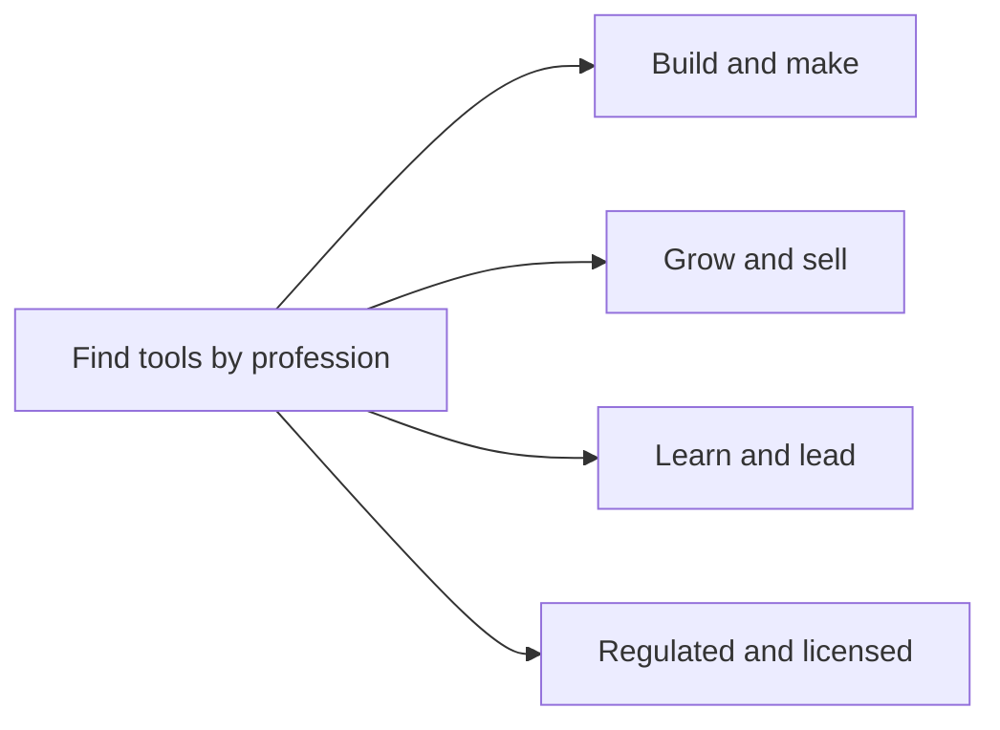

# Professions

Start with your job. Each page maps the real tasks you do to the AI tools and apps that help, with a short starter stack and honest cautions. This is the "I am a teacher, what should I use?" way in.

## How to read these pages

- A tool name that is a **link** has a full [review](../tools/README.md) with ratings and pricing.
- A tool marked **(review pending)** is named because it is genuinely popular for the task, but we have not written its full review yet. We do not give it a score.
- Price labels are coarse on purpose: `free`, `freemium`, `paid`, `enterprise`, `open source`. Exact prices change weekly, so confirm them on the vendor's own site. The detail lives in each tool's review.

## Build and make

| Profession | Sector |
| --- | --- |
| [Software Developer](software-developer.md) | Engineering |
| [Writer and Content Creator](writer.md) | Content |
| [Designer](designer.md) | Design |

## Grow and sell

| Profession | Sector |
| --- | --- |
| [Marketer](marketer.md) | Marketing |
| [Sales Professional](sales.md) | Sales |
| [Customer Support Agent](customer-support.md) | Support |

## Learn and lead

| Profession | Sector |
| --- | --- |
| [Teacher and Educator](teacher.md) | Education |
| [Student](student.md) | Education |
| [Small Business Owner](small-business-owner.md) | Business |

## Regulated and licensed

These pages carry extra caution. In these fields a wrong answer can cost a license, a case, or a patient. The tools help, but a qualified human must verify and sign off.

| Profession | Sector |
| --- | --- |
| [Doctor and Clinician](doctor.md) | Healthcare |
| [Lawyer](lawyer.md) | Legal |
| [Accountant and Bookkeeper](accountant.md) | Finance |

## Planned professions

The list will keep growing. If your job is not here, that is useful signal.

<strong>On the roadmap</strong>

- Data Analyst and Data Scientist
- Product Manager
- Project Manager
- Recruiter and HR
- Real Estate Agent
- Nurse (beyond the clinician page)
- Researcher and Academic
- Journalist
- Translator and Localizer
- Architect and Engineer (built environment)
- Financial Analyst and Advisor
- Video Creator and Photographer
- Administrative and Executive Assistant
- Consultant

[Suggest a profession or a tool](../.github/ISSUE_TEMPLATE/suggest-a-tool.md), or add one yourself with the [profession page template](../docs/profession-page-template.md).

Back to [README](../README.md) | [All tools](../tools/README.md) | [Categories](../docs/categories.md)
